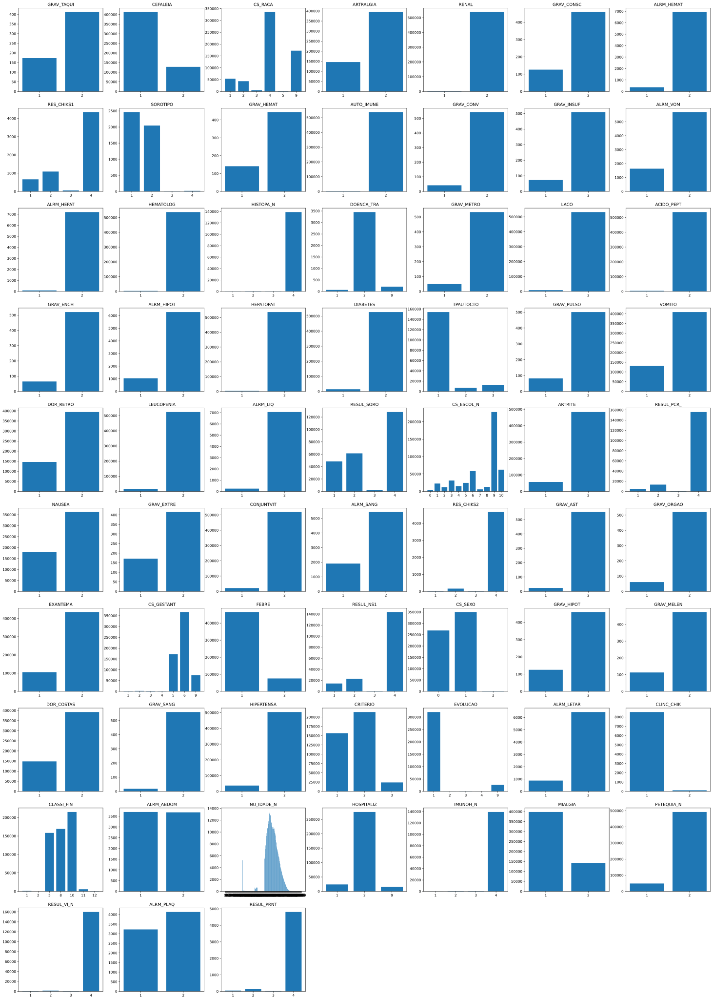
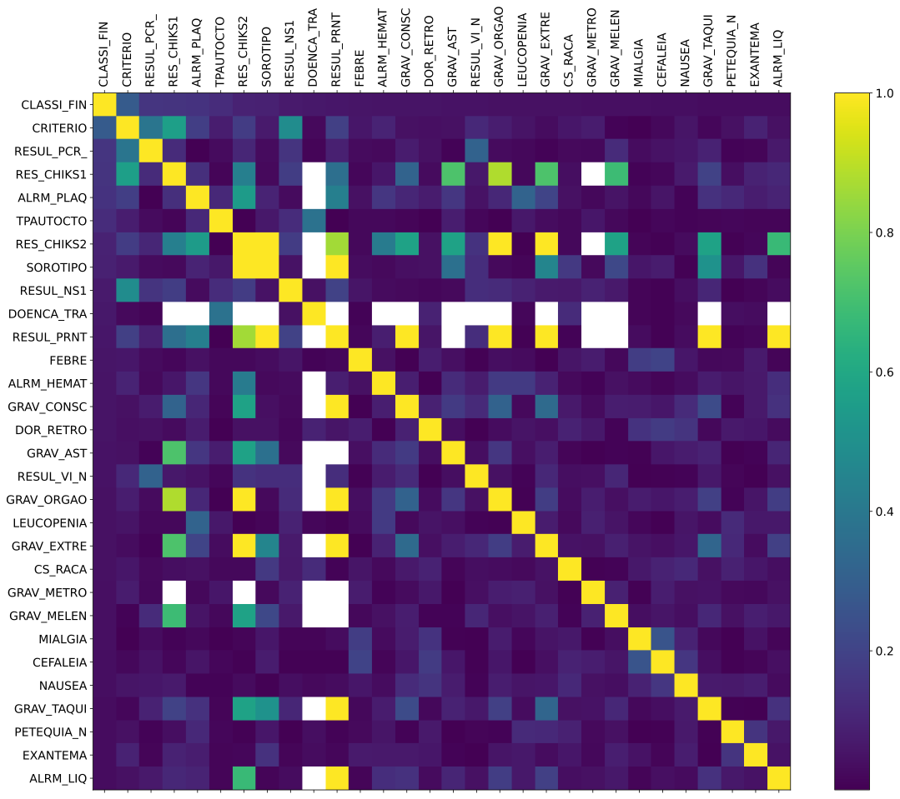
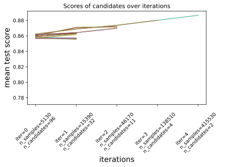

# Relatório
## Primeira Semana - 04/06
### Estatística descritiva com distribuição dos dados, padrões e outliers
Gráficos de histograma de cada campo da base de dados



Matriz de correlação dos campos da base de dados


Decidimos usar `CLASSI_FIN` como output para o nosso modelo

Criamos um campo `DOENTE`. Se o campo `CLASSI_FIN` for algum destes números, seguindo o Dicionário de Dados do SINAN:
```
10-Dengue
11-Dengue comsinais de alarme
12-Dengue grave
13-Chikungunya
```
O campo `DOENTE` será 1. Caso contrário, o campo `DOENTE` será 0.

Usamos a técnica One Hot Encoding para converter dados categóricos em binários, com um campo para cada categoria. 
Por exemplo, ao invez de um campo `CS_SEXO` que possa ser `[F, M ou I]`, criamos três campos `CS_SEXO_F`,`CS_SEXO_M` e `CS_SEXO_I` todos sendo `[1 ou 0]` de acordo com o campo `CS_SEXO`

Removemos todas as linhas que tinham ou `CS_SEXO` ou `CLASSI_FIN` ausente. 


### Divisão dos conjuntos de treino, teste e validação
Utilizamos a função `train_test_split` da biblioteca Scikit-Learn para embaralhar o dataset e depois dividir-lo em dois, sendo 66.7% para treino, e 33.3% para teste, mantendo as proporções de estratificação do campo `DOENTE` afim de manter a mesma porcentagem de doentes em ambos o treino e o teste, já que o dataset é desbalanceado.


### Validação dos algoritmos com métricas de P, R e F1

Os algoritmos foram divididos entre os programadores juniores e seniôr. A atribuição ficou da seguinte forma:

- Marina: Árvore de Decisão;
- Felipe: Rede Neural;
- Pedro: Regressão Logistica;
- Matheus: KNN e Floresta Aleatória.
  


#### Validação Regressão Logistica

O modelo foi testado com os hiperparametros pré-definidos que já estão no padrão dele. Porém, já foi possivel observar que é necessário aumentar o número máximo de interações.


O resultado ficou da seguinte forma:


#### Validação Árvore de Decisão
```python
from sklearn.tree import DecisionTreeClassifier
clf = DecisionTreeClassifier(
    criterion = 'entropy',  # Critério de Divisão: Entropia
    max_depth = None,       # Profundidade Máxima: Sem limite inicial, ajustável com validação cruzada.
    min_samples_split = 2,  # Número Mínimo de Amostras para Divisão de um Nó: 2
    min_samples_leaf = 1,   # Número Mínimo de Amostras em um Nó Folha: 1
)
clf = clf.fit(X_train, y_train)
```
Com os hiperparâmetros pré-definidos nesta etapa inicial da árvore de decisão e após o conjunto de dados pré-processado e dividido em conjuntos de treino e teste, criamos uma baseline inicial para comparação futura com os hiperparâmetros otimizados:


Após o treinamento, foram feitas as previsões no conjunto de teste e avaliada a performance através da acurácia e relatório de classificação:


### Deploy em um container e conexão com dados
Ainda não fizemos por não ter feito todos os modelos. **Perguntar se é só jogar o ipynb numa imagem do Docker**

---

## Segunda Semana - 11/06

## Relatório de Construção do Dashboard de Análise de Casos de Dengue

### Introdução

Este relatório contempla uma das entregas realizadas para a matéria **ADML - 43: ACCS: Oficina de Projetos em Inteligência Artificial**. O objetivo deste relatório é detalhar o processo de criação de um dashboard no Power BI para a visualização dos dados relacionados aos casos de dengue, facilitando a análise e compreensão dos dados.

### Objetivo da Etapa

O objetivo principal desta etapa foi criar um dashboard interativo que permite a visualização e análise dos dados de casos de dengue, fornecendo insights valiosos para monitoramento e tomada de decisão.

### Etapas do Trabalho

#### Dashboard de Visualização dos Dados

Nesta seção, discutiremos as decisões e ideias que nortearam a construção do dashboard requerido para esta entrega. O dashboard foi construído no Power BI e pode ser visualizado dinamicamente na plataforma Power BI Online. Para aqueles que preferirem, o arquivo do dashboard pode ser baixado para acesso pelo aplicativo do Power BI em seu computador pessoal.

[Visualizar Dashboard Interativo](https://app.powerbi.com/view?r=eyJrIjoiMGQxZWM4ZDQtN2E3Ny00YTQyLThmOTEtZDIwZTcxMDc4MmRjIiwidCI6ImRmNzFmNmJiLWUzY2MtNGY1Yi1iNTMyLTc5ZGUyNjFiNTFhMiJ9)

[Baixar Arquivo PBIX](./Casos%20Dengue.pbix)

#### Seleção e Manipulação dos Dados para Visualização

Para a construção do dashboard, utilizamos dados de casos de dengue, que foram pré-processados para incluir apenas colunas relevantes. As principais alterações realizadas nos dados foram:

- **Agrupamento de Idade:** Transformação dos valores da coluna de idade para uma escala em anos.
- **Classificação de Sexo:** Alteração dos valores de sexo para "Homem" e "Mulher", removendo valores nulos e indiferenciados.
- **Filtro Geográfico:** Foco nas notificações da região da Bahia.

#### Escolha das Visualizações

As visualizações foram escolhidas para fornecer uma visão abrangente e detalhada dos casos de dengue, permitindo análise sob diferentes perspectivas. As visualizações incluem:

1. **Mapa de Notificações:** Mostra a distribuição geográfica dos casos notificados por município.
2. **Mapa de Casos Confirmados e Óbitos:** Destaque dos municípios com maior incidência de casos confirmados e óbitos.
3. **Gráfico de Linha Temporal:** Evolução dos casos confirmados por mês e ano.
4. **Indicadores Gerais:** Quantidade total de notificações, casos confirmados, casos graves, óbitos e óbitos em investigação.
5. **Distribuição por Faixa Etária e Sexo:** Gráficos de barras e pizza mostrando a distribuição dos casos por faixa etária e sexo.
6. **Distribuição por Etnia:** Gráfico de barras mostrando a distribuição dos casos por etnia.

### Imagens do Dashboard

#### Página 1: Dados Gerais


#### Página 2: Gráficos


#### Página 3: Mapas


### Insights Extraídos a Partir do Dashboard

A partir das visualizações elaboradas no dashboard, alguns insights importantes foram obtidos:

1. **Distribuição Geográfica:** A maioria das notificações de dengue está concentrada em determinados municípios da Bahia, permitindo direcionar esforços de prevenção e controle.
2. **Evolução Temporal:** Os gráficos de linha mostram picos de casos confirmados em certos meses, indicando períodos de maior incidência.
3. **Perfil dos Afetados:** A maioria dos casos confirmados é do sexo feminino, com maior incidência em adultos. A etnia mais afetada é a parda.
4. **Casos Graves e Óbitos:** A quantidade de casos graves e óbitos é relativamente baixa em comparação ao total de notificações, mas merece atenção especial.

### Conclusão

O dashboard criado fornece uma ferramenta poderosa para a análise dos casos de dengue, permitindo uma compreensão detalhada e facilitando a tomada de decisões informadas. As visualizações interativas permitem explorar os dados de diferentes ângulos, ajudando a identificar padrões e tendências importantes.


### Avaliação dos hiperparâmetros

### Monitoramento da performance do modelo

---

<!-- ## Terceira Semana - 18/06
### Estatística descritiva com distribuição dos dados, padrões e outliers para o pré-processamento definidos
Mesma coisa que o da primeira semana. 

### Divisão dos conjuntos de treino, teste e validação
Mesma coisa que o da primeira semana.

### Validação dos algoritmos com métricas de P, R e F1

### Deploy em um container e conexão com dados; 


--- -->

## Quarta Semana - 25/06
### Dashboard de visualização dos dados

### Avaliação dos hiperparâmetros e proposta de novos hiperparâmetros mais adequados aos dados
Para tunar os hiperparâmetros dos modelos, usamos a classe `HalvingGridSearchCV` da biblioteca Scikit-Learn, que basicamente faz um Grid Search porém com poucos dados no inicio, descarta os modelos mais fracos, depois treina novamente os modelos restantes com o dobro de dados, até chegar no dataset total. Utilizamos Stratified Cross Validation, com K = 3, por ser bem mais rápido e não apresentar muitas diferenças se comparado com K = 5 ou K = 10. 
Decidimos optimizar a métrica f1-score, já que o dataset é desbalanceado. 

#### K-Nearest Neighbors (KNN)

Parâmetros tunados:
```python
hyperparameters = {
    "n_neighbors" : [5,7,10,13,15,20],
    "weights": ['uniform', 'distance']
}
```
---

#### Árvore de Decisão
A imagem seguinte apresenta a otimização dos hiperparâmetros na árvore de decisão:


Visando a melhor configuração do modelo, diferentes valores para os hiperparâmetros foram testados, sendo eles:
`criterion`: Critério de divisão da árvore ('gini', 'entropy' ou 'log_loss'). Define como a árvore decide qual atributo usar para dividir os dados em cada nó.
`min_samples_split`: Número mínimo de amostras necessárias para dividir um nó interno (2, 4, 8 ou 16). Controla o tamanho mínimo de um nó para que ele seja dividido em dois nós filhos.
`min_samples_leaf`: Número mínimo de amostras em um nó folha (1, 2, 4, 8, 16, 32, 64 ou 128). Controla o tamanho mínimo de um nó para que ele seja considerado um nó folha.

Parâmetros tunados:
```python
hyperparameters = {
    'criterion' : ['gini', 'entropy', 'log_loss'],  # Critério de Divisão: Entropia
    'min_samples_split': [2,4,8,16],                # Número Mínimo de Amostras para Divisão de um Nó: 2
    'min_samples_leaf': [1,2,4,8,16,32,64,128],     # Número Mínimo de Amostras em um Nó Folha: 1
}
```

Melhores hiperparâmetros encontrados: 
```python
{'criterion': 'gini', 'min_samples_leaf': 32, 'min_samples_split': 16}
```
Melhor F1-score : 0.8865631871945879

O relatório de classificação detalhado para o modelo otimizado é apresentado a seguir:

|              | precision | recall | f1-score | support      |
|--------------|-----------|--------|----------|--------------|
| 0            | 0.93      | 0.94   | 0.93     | 131690       |
| 1            | 0.89      | 0.87   | 0.88     | 72980        |
| accuracy     |           |        | 0.91     | 204670       |
| macro avg    | 0.91      | 0.91   | 0.91     | 204670       |
| weighted avg | 0.92      | 0.92   | 0.92     | 204670       |

Analisando o relatório, é possível observar que o modelo apresenta uma acurácia de 91%, indicando um bom desempenho na classificação das amostras, além de alta precisão e recall na classe 0, mesmo que a classe 1 não tenha alcançada resultados tão elevados.

---

#### Rede Neural (Multilayer Perceptron - MLP)

Parâmetros tunados:
```python
hyperparameters = {
    'hidden_layer_sizes' : [(100, 100), (100,100,100), (100,100,100,100), (200,200), (300,300), (100,200,300), (400,400,400)],
    'criterion' : ['gini', 'entropy', 'log_loss'],  # Critério de Divisão: Entropia
    'n_estimators': [10,100,200,250,400,800],     # Número Mínimo de Amostras em um Nó Folha: 1
}
```
---

#### Logistic Regression (Regressão Logística)

Parâmetros tunados:
```python

hyperparameters = {
    "max_iter": [1000],
    "solver": ['newton-cg', 'lbfgs', 'liblinear', 'sag', 'saga'],
    "penalty":["l1","l2"]
}

```


Melhores hiperparâmetros: 
```python
{'max_iter': 1000, 'penalty': 'l2', 'solver': 'saga'}
```
Melhor F1-score :0.8751328155228276

|              | precision | recall | f1-score | support      |
|--------------|-----------|--------|----------|--------------|
| 0            | 0.92      | 0.93   | 0.93     | 131690       |
| 1            | 0.88      | 0.86   | 0.87     | 72980        |
| accuracy     |           |        | 0.91     | 204670       |
| macro avg    | 0.90      | 0.90   | 0.90     | 204670       |
| weighted avg | 0.91      | 0.91   | 0.91     | 204670       |

---

#### Random Forest (Floresta Aleatória)

Parâmetros tunados:
```python
hyperparameters = {
    'criterion' : ['gini', 'entropy', 'log_loss'],  # Critério de Divisão
    'n_estimators': [10,100,200,250,400],     # Número Mínimo de Amostras em um Nó Folha
}
```


Melhores hiperparâmetros: 
```python
{'criterion': 'log_loss', 'n_estimators': 400}
```

|              | precision | recall | f1-score | support      |
|--------------|-----------|--------|----------|--------------|
| 0            | 0.92      | 0.94   | 0.94     | 131690       |
| 1            | 0.89      | 0.88   | 0.88     | 72980        |
| accuracy     |           |        | 0.92     | 204670       |
| macro avg    | 0.91      | 0.91   | 0.91     | 204670       |
| weighted avg | 0.92      | 0.92   | 0.92     | 204670       |

Melhor F1-score : 0.8772515927873686

### Monitoramento de desempenho do modelo


|              | precision | recall | f1-score |
|--------------|-----------|--------|----------|
| Random Forest            | 0.92      | 0.94   | 0.94     |
| Logistic Regression            | 0.92      | 0.93   | 0.93     |
| Decision Tree            | 0.93      | 0.94   | 0.93     | 131690       |

---

